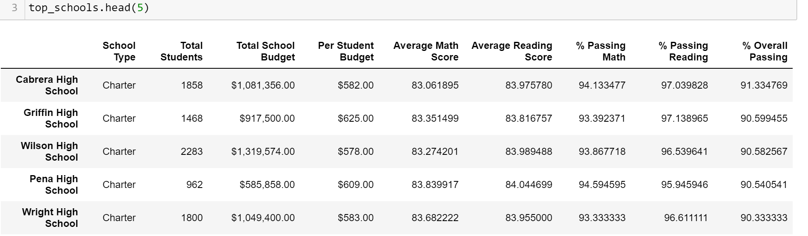
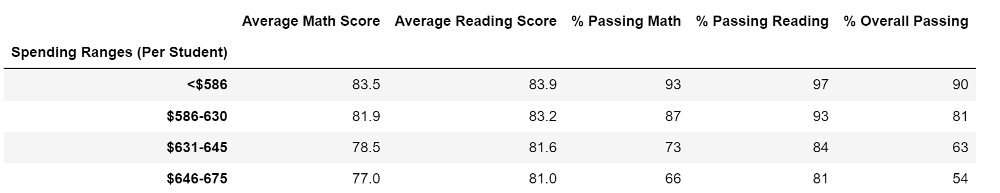

# School_District_Analysis
DABC Module 4. Python 3.9.12, Conda 4.12.0.

Laurina LaStella

# Overview of the school district analysis:
Testing two scenarios for how to handle unreliable data, with different results. Each can be useful, depending on circumstances. 
- One scenario is to keep the records, but eliminate the data entries determined to be unreliable.
- The other scenario is to eliminate the records entirely, and proceed with an incomplete, but more reliable, data set.

Using Jupyter Notebook, Python, Pandas, and NumPy to practice organizing and grouping data. Some of the skills practiced:
- Reading CSV files.
- Creating dataframes, series, and variables.
- Evaluating for Null and Not Null values.
- Working with multiple, sometimes incompatible data types.
- Applying parameters for locating specific entries in dataframes.
- Locating and replacing values.
- Re-ordering columns in a dataframe.
- Applying formatting to columns.

___
### Labels for sections and images below:

## "NaN Analysis"
#### Thomas High School, 9th grade student records preserved in the dataframe, but scores replaced with NaN.

## "10th to 12th Analysis"
#### Thomas High School, 10th through 12th grade student records only. 9th grade student records eliminated from dataframe.
___

# District Summary

## How is the district summary affected?
- Student Count is lower with the student scores dropped. 
- No other changes to District totals.

District Summary, Original Calculations, All Columns

NaN Analysis: : District Summary, "Total Students" re-calculated without 9th graders from Thomas High School. No other changes. Averages stay the same.

10th to 12th Analysis: District Summary, "Total Students" re-calculated without 9th graders from Thomas High School. No other changes. Averages stay the same.

## How is the school summary affected?
- Thomas High School's Percent Passing numbers were artificially lowered by the presence of NaN values in the calculations. Passing percentages increased across the board after the 9th grade student records were removed. Average scores were unchanged.
    - Percent Passing Math increased from 66.9% to 93.2%.
    - Percent Passing Reading increased from 69.7% to 97.0%.
    - Percent Overall Passing increased from 65.1% to 90.6%.

Reference: Column Headers

NaN Analysis: All Columns

10th to 12th Analysis: All Columns

## How does replacing the ninth graders’ math and reading scores affect Thomas High School’s performance relative to the other schools?

- Thomas High School's performance increased their ranking to be included in the Top 5, after the 9th grade was eliminated from the dataframe.
- Rankings of the Bottom 5 schools are unchanged.

NaN Analysis: Top 5 Scores by School

10th to 12th Analysis: Top 5 Scores by School

NaN Analysis: Bottom 5 Scores by School

10th to 12th Analysis: Bottom 5 Scores by School

## How does replacing the ninth-grade scores affect the following:

- Scores by school spending
    - Thomas High School is in the Spending Range of $631-645. Impact is only on that spending range.
    - Percent Passing Math increased from 67% to 73%.
    - Percent Passing Reading increased from 77% to 84%.
    - Percent Overall Passing increased from 56% to 63%.

NaN Analysis: Scores by School Spending Categories

10th to 12th Analysis: Scores by School Spending Categories

- Scores by school size
    - Thomas High School is in the Medium size category. Impact is only on the Medium School Size.
    - Percent Passing Math increased from 88% to 94%.
    - Percent Passing Reading increased from 91% to 97%.
    - Percent Overall Passing increased from 85% to 91%.

NaN Analysis: Scores by School Size

10th to 12th Analysis: Scores by School Size

- Scores by school type
    - Thomas High School is a Charter school. Impact is only on Charter School Type.
    - Percent Passing Math increased from 90% to 94%.
    - Percent Passing Reading increased from 93% to 97%.
    - Percent Overall Passing increased from 87% to 90%.

NaN Analysis: Scores by School Type

10th to 12th Analysis: Scores by School Type

- Math and reading scores by grade
    - No impact on other schools.
    - No impact on other grades at Thomas High School.

NaN Analysis: Math Scores by Grade

10th to 12th Analysis: Math Scores by Grade

NaN Analysis: Reading Scores by Grade

10th to 12th Analysis: Reading Scores by Grade

---
# Summary: 
# After replacing Math and Reading scores with NaN, for 9th grade scores at Thomas High School:
1. Thomas High School Passing Percentages were lower than they should have been. Because the student records were still included in the data, but the scores were elimnated from the percentage calculations, the division was based on too many records and not enough scores.
2. Thomas High School is included in the Top 5 performing schools when the 9th grade student records are eliminated entirely. But it was not in the Top 5 when the records were included, but the scores were null.
3. All Percent Passing summaries of the groups Thomas High School belongs to were impacted by the presence or absence of the 9th grade student records and scores.
4. The changes made to Thomas High School 9th grade records and scores had a large impact on the Percent Passing for every grouping level they belong to, but no impact on other grouping levels, Average Scores, other grades, or other schools.

---
---

###### (Personal observation: Trilogy Education Services is doing Berkely and its DABC students a disservice. No contact information should ever be organized with First Name at the start of a Name text field. Family Name should always be the priority. Ideally, names should be broken into separate fields for Family Name, Given Name, Middle Name, Title, Prefix, and Suffix. Trilogy is teaching sloppy habits to future data professsionals. Berkeley should demand higher standards.)